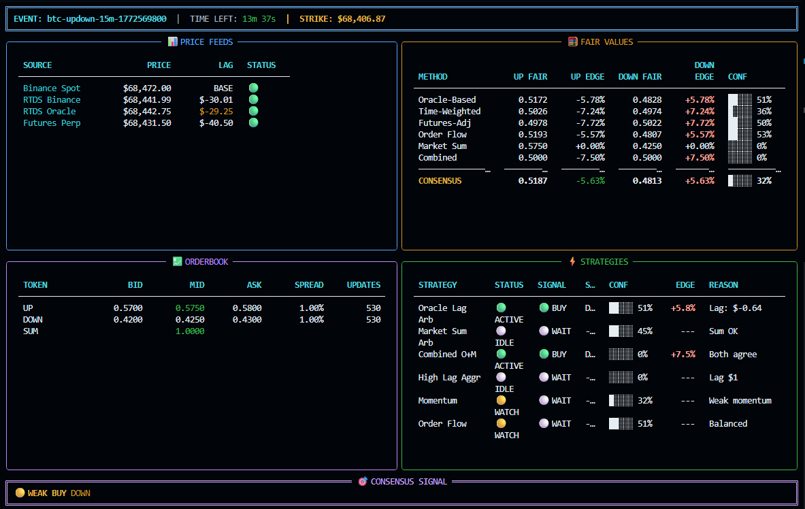

## Features
- Real-time terminal for Polymarket monitoring
- Auto-detects BTC UP/DOWN 15m slug and strike price
- Live price streams from Polymarket and Binance (WebSocket)
- Order book monitoring for UP/DOWN tokens
- Mispricing detection and signal generation (`WAIT`, `WEAK BUY`, `BUY`, `STRONG BUY`)
- Real-time updates: time left, odds, spreads, confidence


## Run
```bash
python3 polymarket_terminal.py
```

## Dependencies
```bash
pip install -r requirements.txt
```

## Data endpoints used
- Binance spot: `wss://stream.binance.com:9443/ws/btcusdt@trade`
- Binance futures: `wss://fstream.binance.com/ws/btcusdt@trade`
- Polymarket RTDS: `wss://ws-live-data.polymarket.com`
- Polymarket CLOB WS: `wss://ws-subscriptions-clob.polymarket.com/ws/market`
- Gamma events API: `https://gamma-api.polymarket.com/events?slug=...`
